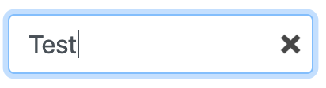

# ResetX

ResetX is a VueJS directive that adds an "X" to input form elements
that, when clicked, clears their value.



## Installation

To use in your own ES6 JavaScript projects simply install this as
a dependency.

```bash
npm install --save https://github.com/app-nerds/resetx
```

## Example Usage

In a Single File Component (SFC):

```vue
<template>
   <input type="text" v-model="myInput" v-reset-x />
</template>

<script>
import { ResetX } from "@app-nerds/resetx";

export default {
   directives: {
      ResetX
   },

   data() {
      return {
         myInput: ""
      };
   }
};
</script>
```

## Project setup

To compile this project locally first clone this repository, then install
dependencies.

```bash
npm install
```

### Compiles and minifies for production

```bash
make
```

or ...

```bash
npm run build:bundle
```

## License

MIT License

Copyright (c) 2019 App Nerds LLC

Permission is hereby granted, free of charge, to any person obtaining a copy
of this software and associated documentation files (the "Software"), to deal
in the Software without restriction, including without limitation the rights
to use, copy, modify, merge, publish, distribute, sublicense, and/or sell
copies of the Software, and to permit persons to whom the Software is
furnished to do so, subject to the following conditions:

The above copyright notice and this permission notice shall be included in all
copies or substantial portions of the Software.

THE SOFTWARE IS PROVIDED "AS IS", WITHOUT WARRANTY OF ANY KIND, EXPRESS OR
IMPLIED, INCLUDING BUT NOT LIMITED TO THE WARRANTIES OF MERCHANTABILITY,
FITNESS FOR A PARTICULAR PURPOSE AND NONINFRINGEMENT. IN NO EVENT SHALL THE
AUTHORS OR COPYRIGHT HOLDERS BE LIABLE FOR ANY CLAIM, DAMAGES OR OTHER
LIABILITY, WHETHER IN AN ACTION OF CONTRACT, TORT OR OTHERWISE, ARISING FROM,
OUT OF OR IN CONNECTION WITH THE SOFTWARE OR THE USE OR OTHER DEALINGS IN THE
SOFTWARE.
